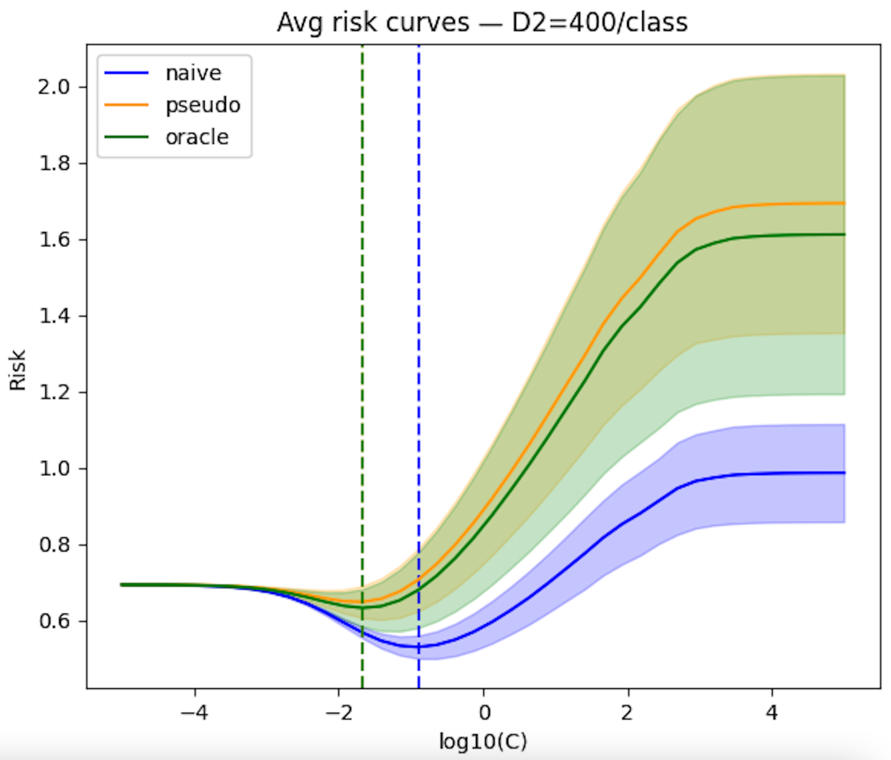
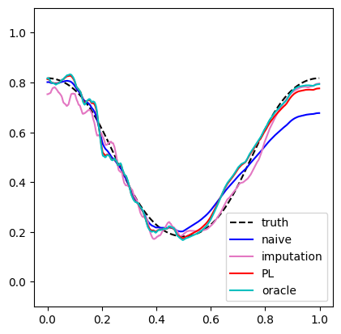
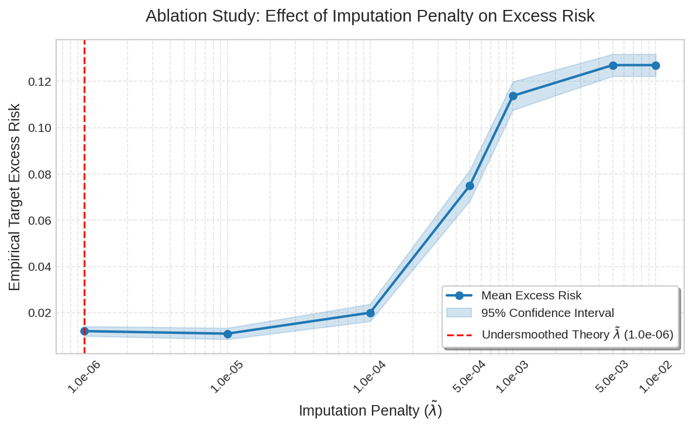

# Code Repository for the Review Process

**Paper:** *Pseudo-Labeling for Unsupervised Domain Adaptation with Kernel GLMs* (NeurIPS 2026 Submission)

This anonymous repository contains the code and reproducible scripts for the paper's experiments.

## Baselines Comparisons (`benchmark_raisin_full.ipynb`, Section 5.2)
**Objective:** Compare our GLM Pseudo-Labeling framework against established density-ratio (Importance Weighting) and KRR pseudo-labeling baselines.
* **Methods Included:**
  * Unsupervised GLM Pseudo-Labeling (Ours)
  * KRR Pseudo-Labeling (Wang, 2026)
  * Importance-Weighted Cross-Validation via KLIEP (KLIEP-IW)
  * Importance-Weighted Cross-Validation via Kernel Mean Matching (KMM-IW)
* **Description:** This script runs the strict "split-and-fit" cross-validation pipeline across 100 random seeds on the Raisin dataset (CC BY 4.0 license), as described in Section 5.2 of the paper. It tracks the candidate selection process via log-loss (cross-entropy) and demonstrates the instability of density-ratio methods as well as the calibration failure of unconstrained squared-loss selection (KRR).

| Method Category | Selection Strategy / Model | Target Risk (Mean) | Standard Error (SE) |
| :--- | :--- | :--- | :--- |
| **Ours (Kernel GLM)** | **Pseudo-Labeling (Unsupervised)** | **0.383** | **0.006** |
| | Oracle (True Target Labels) | 0.376 | 0.007 |
| **Wang (2026) KRR** | Pseudo-Labeling (Unsupervised) | 0.406 | 0.009 |
| | Oracle (True Target Labels) | 0.443 | 0.007 |
| **KLIEP (Density Ratio)** | Importance-Weighted CV | 0.438 | 0.014 |
| | Oracle (True Target Labels) | 0.384 | 0.007 |
| **KMM (Density Ratio)** | Importance-Weighted CV | 0.449 | 0.009 |
| | Oracle (True Target Labels) | 0.437 | 0.008 |
| **Baseline** | Naive (Source-Only) | 0.442 | 0.014 |

## WILDS (`wilds_dino_exp_final.ipynb`)

This experiment evaluates our pseudo-labeling method for regularization selection under a realistic Unsupervised Domain Adaptation (UDA) scenario using the Camelyon17 (CC0 license) dataset from the WILDS benchmark. The goal is tumor detection in histopathology patches across a natural domain shift (source: hospitals 0–3, unlabeled target: hospital 4). 

**Setup & Preprocessing**
* **Features:** We extract 768-dimensional representations using a frozen pretrained DINOv2 ViT-B/14 backbone. 
* **Dimensionality Reduction:** We apply standardization and joint PCA (top 256 components). This step is critical: in the raw 768-dim ambient space, the domain shift is largely orthogonal to the classification signal. Projecting onto the principal directions of the pooled feature covariance retains the subspace where source and target distributions most differ, inducing the regularization path divergence our method exploits. 
* **Scalability:** By operating smoothly in this space, our pseudo-labeling method sidesteps the crippling RAM bottlenecks that traditional density ratio methods (like KMM or KLIEP) face when computing kernel matrices across tens of thousands of target samples.
* **Evaluation:** Candidate ridge logistic regression models are trained on $D_1$ (50 samples/class), sweeping regularization parameter $C$ over 40 log-uniform values from $10^{-5}$ to $10^5$. The imputer model is trained on $D_2$ (100, 200, or 400 samples/class) with minimum regularization to generate soft pseudo-labels on the target covariates. Results are averaged over 100 random seeds.

#### Results

Figure 1 plots the selection risk curve for the three methods, across all random seeds. It shows that selecting the regularization strength with the pseudo-labeling method closely matches the oracle (that knows the target labels), as opposed to the naive source-only baseline.

   
  <em>Figure 1: Camelyon17 experiment results.</em>

| $D_2$ / class | Method | Mean Target NLL | 95% CI | Mean $C$ Selected |
| :--- | :--- | :--- | :--- | :--- |
| **100** | Naive | 0.682 | [0.662, 0.702] | 0.153 |
| | **Pseudo (Ours)** | **0.645** | **[0.637, 0.653]** | **0.012** |
| | Oracle | 0.621 | [0.611, 0.631] | 0.034 |
| **200** | Naive | 0.678 | [0.659, 0.698] | 0.138 |
| | **Pseudo (Ours)** | **0.633** | **[0.624, 0.643]** | **0.019** |
| | Oracle | 0.621 | [0.611, 0.631] | 0.034 |
| **400** | Naive | 0.677 | [0.658, 0.696] | 0.127 |
| | **Pseudo (Ours)** | **0.630** | **[0.620, 0.639]** | **0.023** |
| | Oracle | 0.621 | [0.611, 0.631] | 0.034 |

#### Key Takeaways

1. **Pseudo-Labeling Outperforms Naive Validation:** Across all $D_2$ sizes, our method achieves substantially lower target Negative Log-Likelihood (NLL) with non-overlapping confidence intervals. The naive method systematically selects too little regularization ($C \approx 0.13-0.15$). Pseudo-labeling corrects this, selecting a $C$ much closer to the Oracle's ideal $0.034$ without ever observing target labels. *(Note: While accuracy remains coarse and undifferentiated at ~0.66 for all methods, NLL correctly captures the superior conditional probability estimation and calibration of our approach).*
2. **Monotonic Improvement with Data:** As imputer data ($D_2$) grows from 100 to 400 samples per class, pseudo-target NLL steadily decreases from $0.645$ to $0.630$, converging toward the Oracle. The selected $C$ similarly converges from $0.012$ to $0.023$. This directly reflects the theoretical oracle inequality: more data reduces imputer bias, aligning the pseudo-risk closer to the true target risk.
3. **Striking Variance Reduction:** Pseudo-labeling not only improves mean performance but dramatically stabilizes model selection. It reduces the standard deviation of selection across seeds from $\approx 0.10$ (Naive) down to $\approx 0.04-0.05$, effectively matching the Oracle's stability—a crucial property for real-world deployment.

## Toy Example (`demo_covariate_shift.ipynb`)
**Objective:** Demonstrate the necessity of target-specific adaptation, achieved through target-aware Ridge regularization's parameter selection for well-specified models.
* **Description:** This simulation generates a well-specified synthetic environment undergoing covariate shift. It compares the risk landscape of models tuned exclusively on the source distribution (Naive) versus models tuned via our target-optimal penalty selection.
* **Results:** The simulation showcases that the presence of covariate shift alters the optimal regularization path. Relying on source-optimal penalties leads to severe target risk degradation, highlighting why unsupervised target adaptation is required.

**The Setup:**
* **Feature space:** $[0,1]$.
* **Sample sizes:** $n = 4000$ labeled source samples and $n_0 = n$ unlabeled target samples.
* **Response model:** Kernel logistic regression, where $y \mid x \sim \text{Bernoulli}(\sigma(f^\ast(x)))$ with the true latent function $f^\ast(x) = 1.5\cos(2\pi x)$, and $\sigma$ the sigmoid function.
* **Source covariate distribution ($\mathcal{P}$):** Concentrated on the left, $\frac{B}{B+1}\mathcal{U}[0, 1/2] + \frac{1}{B+1}\mathcal{U}[1/2, 1]$ with $B=n^{0.45}$.
* **Target covariate distribution ($\mathcal{Q}$):** Concentrated on the right, $\frac{1}{B+1}\mathcal{U}[0, 1/2] + \frac{B}{B+1}\mathcal{U}[1/2, 1]$ with $B=n^{0.45}$.
* **Kernel:** First-order Sobolev kernel, $K(z,w) = \min(z,w)$.

We split the labeled source data in half. On the first half, we run kernel logistic regression with a grid of different ridge penalty parameters ($\lambda$) to obtain a collection of candidate models. 

First, we note the necessity of adapting to covariate shift. On the left panel below, we plotted three candidate models with different penalties. We see that the optimal choice is different for the source and target distributions. On the interval $[0, 1/2]$ where source data is abundant, a large penalty (cyan) provides a great fit. However, on the interval $[1/2, 1]$ where source data is sparse but target data is heavily concentrated, this large penalty oversmooths, and a smaller penalty (red) actually performs better for the target domain.

Then on the right panel below, we compare three model selections methods based on different validation datasets:
* **Naive method (blue)**: validating on the held-out source data, it selects a suboptimal model that fails to adapt to the target distribution.
* **Oracle method (cyan)**: uses true, noiseless target responses.
* **Proposed method (red)**: using only the unlabeled target data with our generated soft pseudo-labels, it successfully selects an adaptive model, achieving performance highly comparable to the oracle.

  
  

*Figure 2: Covariate shift and its adaptation in Kernel Logistic Regression. The black dashed curves show the true latent function* $f^\ast(x)$ *.*

*(Note: We also visualize the imputation model used to generate the pseudo-labels, shown in pink. While unsuitable for direct prediction, it is effective for model selection with pseudo-labels).*

For full reproducible details—including the exact grid of hyperparameters and the specific $\lambda$ penalties selected by each method—please refer directly to the `demo_covariate_shift.ipynb` notebook. The final quantitative performance of the selected models is summarized below:

| Method | Target Excess Risk | 95% condidence interval |
| :--- | :--- | :--- |
| **Naive** | 0.016300 | [0.014926, 0.017674] |
| **Pseudo-labeling (Ours)** | 0.003481 | [0.001954, 0.005008] |
| **Oracle** | 0.002855 | [0.001312, 0.004399] |

## Ablation Study (`ablation_logistic.ipynb`): Validating the Undersmoothed Imputation Penalty

**Objective:** To empirically validate our theoretical insight that the imputation model penalty ($\tilde{\lambda}$) must be small to guarantee valid model selection.

**Description:**
Our theoretical analysis dictates that the imputation model must be **undersmoothed** to ensure valid model selection with pseudo-labels. While our theoretical guarantees (Theorem B.1) hold for finite samples, isolating the leading-order effects that govern the optimal penalty scaling requires a sufficiently large sample size. We evaluate our method using $n$ = 16,000 to empirically validate this regime without interference from finite-sample noise. To ensure statistical significance, we sweep across a grid of penalty values and measure the empirical target excess risk of the final estimator over 50 independent Monte Carlo trials. We use the same setup as the previous toy example, i.e. same feature space, response model, and kernel.

**Results:**
The output empirically demonstrates that low regularization on the imputer is necessary to achieve Oracle-level target risk, perfectly aligning with the oracle inequality derived in Theorem B.1 of the paper.

#### Quantitative Summary

| Imputation Penalty ($\tilde{\lambda}$) | Regime | Empirical Target Excess Risk |
|:---|:---|:---|
| **$10^{-5}$** | **Undersmoothed (Optimal)** | **0.011 ± 0.001** |
| $10^{-4}$ | Intermediate | 0.020 ± 0.002 |
| $10^{-3}$ | Standard Baseline | 0.114 ± 0.003 |

#### Main Takeaways
* **Theory Confirmed:** The empirically optimal penalty ($\tilde{\lambda} = 10^{-5}$) matches our theoretical requirement for an undersmoothed imputation model.
* **Massive Performance Gap:** Using the optimal undersmoothed penalty yields a **>10x reduction in excess risk** compared to a standard baseline penalty (0.011 vs. 0.114).
* **Statistical Significance:** The improvement of the undersmoothed estimator over the baseline is highly statistically significant across all random seeds ($p < 10^{-34}$, paired t-test).

## Synthetic Data (Section 5.1)
We test our approach using logistic regression with the first-order Sobolev kernel, as explained in Section 5.1 of the paper. 
* **Run the experiment:** Use `run_experiments_logistic.ipynb`. This notebook calls `pseudo_label_experiment_general.py` (or `pseudo_label_experiment_general_KeOps.py` for the KeOps version).
* **Results:** Because the full experiment is computationally intensive, we have provided the final results in:
    * `results_logistic_torchcpu_1_5_cos_0_4_shift.zip` (covariate shift strength $B=n^{0.4}$) 
    * `results_logistic_torchcpu_1_5_cos_0_45_shift.zip` (covariate shift strength $B=n^{0.45}$) 
* **Plotting:** The results can be plotted using `plot_curves_synthetic.ipynb`, which outputs `logistic_errors_04.pdf` and `logistic_errors_045.pdf`.

## 🧮 Algorithmic Details
We implemented a generic solver for kernel GLMs in Python, using the Fisher scoring method. For full mathematical details and notes on our scalable GPU implementation with KeOps, please see our [Algorithmic Details document](ALGORITHM.md).

## 🛠️ Solvers
This repository provides a general solver for kernel ridge regression, kernel logistic regression, and kernel Poisson regression. Standard kernels are available (e.g., linear, polynomial, RBF, first-order Sobolev).

* `rkhs_glm_scaled.py`: Provides the basic solver for ridge-regularized kernel GLMs. For relatively small sample sizes ($n \le 5000$), a simple version using only Numpy and Scipy is enough. 
* `rkhs_glm_scaled_KeOps.py`: For larger problems, we implement the IRLS inner linear solves using kernel matvec oracles computed on-the-fly on the GPU, using the KeOps library.

**Compute resources:**. All reported experiments were run on Google Colab Pro. Most runs are CPU-reproducible and do not require specialized hardware; Colab Pro was used primarily for convenience. The main experimental runs used High RAM Colab CPU runtimes with approximately 30 GB RAM. GPU acceleration was used only for the PyKeOps-based kernel computation module, where it reduces runtime but is not essential to the proposed model-selection procedure.

## References & Acknowledgements

The experimental evaluation framework for the real-world dataset builds upon the open-source implementation provided by Feng et al. (2023). We adapted and significantly extended their cross-validation pipeline to integrate the proper unweighted candidate training for our GLM framework, re-using their KLIEP density ratio estimation implementation `KLIEP_importance_estimation.py`. The KRR pseudo-labeling baseline methodology follows Wang (2026). The second real-data experiment relies on the Camelyon17 dataset, utilizing the standardized hospital-based domain splits curated by the WILDS benchmark for evaluating out-of-distribution generalization.

* **Feng, X., He, X., Wang, C., Wang, C., & Zhang, J. (2023).** Towards a unified analysis of kernel-based methods under covariate shift. *Advances in Neural Information Processing Systems*, 36, 73839-73851.
* **Wang, K. (2026).** Pseudo-labeling for kernel ridge regression under covariate shift. *The Annals of Statistics*, 54(1), 252-276.
* **WILDS Benchmark:** Koh, P. W., Sagawa, S., Marklund, H., et al. (2020). *WILDS: A Benchmark of in-the-Wild Distribution Shifts*. 
* **Camelyon Dataset:** Litjens, G., Bandi, P., Ehteshami Bejnordi, B., et al. (2018). *1399 H&E-stained sentinel lymph node sections of breast cancer patients: the CAMELYON dataset*. GigaScience, 7.

